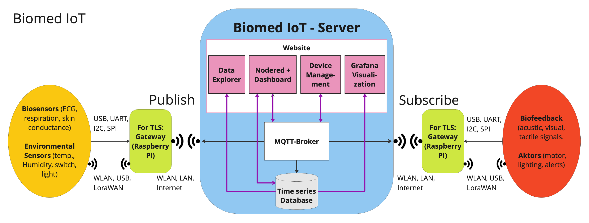

# Biomed IoT

An open source IoT platform for data collection, visualization and automation.

## Installation:

### Requirements
The setup and platform has been tested on a cleanly installed Debian server 12 with Python 3.11.2 on a Raspberry Pi 4. It is recommended to create a new Linux user under which the platform will run.

### Setup
If you setup Biomed IoT on a Raspberry Pi, get Debian for Pi here: https://raspi.debian.net

The guided setup process makes sure you get Biomed IoT installed on your system. Start by running these commands:
```
cd ~
git clone https://github.com/BioMedLab-HM/biomed-iot.git
cd biomed-iot
sudo python3 setup.py
```
After setup finishes, reboot:
``` 
sudo reboot
```

### Points of failure  
- Do not cancel setup prematurely. Depending on speed of download servers the duration of the setup may vary usually between five and 15 minutes.
- The setup script requires sudo permissions. Ensure that the user running the setup has sudo privileges.
- To check your installation [follow this guide](tests/tests_after_setup.md)

### Testing of MQTT-Server/Network performance etc.
A performance test script will come soon...

## How it works


## How to use
The *manual.pdf* file (also see 'Manual' in website menu) contains a guided tour through Biomed IoT and helps you to setup a working example.

Use the platform at your own risk. If you make it public on the internet, use a legitimate privacy policy and imprint. 
